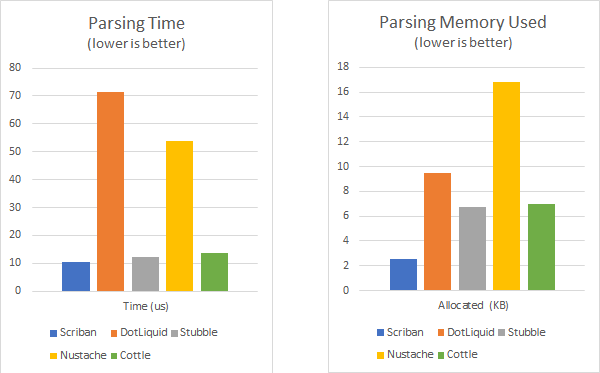
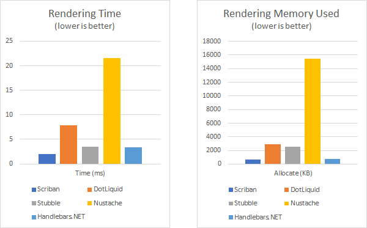

# Benchmarks

Latest benchmark update: 07 March 2019

> NOTE: This is a micro benchmark, so results may vary vastly on use cases. The goal here is to demonstrate on a very simple example how the different engines behave
> Also, while Scriban is compared here to `liquid` and `mustache` like templating engines, you should  keep in mind that language-wise, Scriban is allowing a lot more language constructions/expressions.

The benchmark was performed on two aspects of the libraries:

- The [**Parser Benchmark**](#parser-benchmarks): How long does it take to parse a template to a runtime representation? How much memory is used?
- The [**Rendering Benchmark**](#rendering-benchmarks): How long does it take to render a template with some input datas? How much memory is used?

Libraries used in this comparison:

- Scriban (2.0.0-alpha-006), Syntax: Scriban
- [Fluid](https://github.com/sebastienros/fluid/) (Fluid.Core.1.0.0-beta-9545), Syntax: Liquid based
- [DotLiquid](https://github.com/dotliquid/dotliquid) (2.0.298), Syntax: Liquid based
- [Stubble](https://github.com/StubbleOrg/Stubble) (1.2.7), Syntax: Mustache+ based
- [Nustache](https://github.com/jdiamond/Nustache) (1.16.0.8), Syntax: Mustache based
- [Handlebars.NET](https://github.com/rexm/Handlebars.Net) (1.9.5), Syntax: Handlebars based
- [Cottle](https://github.com/r3c/cottle) (1.4.2), Syntax: Cottle

We are also adding [Razor](https://github.com/aspnet/Razor) (2.0.0), Syntax: Razor/C#, not in the charts and in the raw results. This is not a relevant comparison for the fact that it a not a "end-user" text templating engine (not safe) but it gives some insights about the best raw performance you can achieve with it for the rendering part, as it is generating very raw pre-compiler C# code that is basically issuing a bunch of `WriteLiteral(text_as_is)`, so you can't really do better here in terms of performance.

For benchmarking, we are using the fantastic [BenchmarkDotNet](https://github.com/dotnet/BenchmarkDotNet)

See the [Scriban.Benchmark/Program.cs](../src/Scriban.Benchmarks/Program.cs) for details of the benchmark implementation.

[:top:](#benchmarks)
## Overall results

For the parser part:

- **Scriban parser is 3x to 6x times** faster compared to liquid based templating parsers
- **Scriban parser takes 3x to 40x times less memory** compared to other templating parsers

If you look at Razor (which is again, not really fair), `scriban` is roughly 1000x times faster than Razor for parsing a template. Which is perfectly normal, as Razor is involving the full Roslyn/C# compiler here. It is taking a lot more memory...etc. But it is generating an ultra efficient renderer.

For the rendering part:

- **Scriban is 1.2x to x14 times faster** than most of the other templating engines (Note that the new version of Fluid in this test is now 5-8% faster than Scriban on the rendering side)
- **Scriban takes 3x to x65 times less memory** compared to most of other templating engines

In comparison to Razor, `scriban` is only 4-5 times slower than Razor, which is fairly honorable, considering how much raw is a compiled Razor template.

In the following sections, you will find benchmark details.

[:top:](#benchmarks)
## Parser Benchmarks

The methodology is to compile the following Scriban script:

```html
<ul id='products'>
  {{ for product in products }}
    <li>
      <h2>{{ product.name }}</h2>
           Only {{ product.price }}
           {{ product.description | string.truncate 15 }}
    </li>
  {{ end }}
</ul>
```

Or the equivalent Liquid script

```html
<ul id='products'>
  
    <li>
      <h2>{{ product.name }}</h2>
           Only {{ product.price }}
           {{ product.description | truncate: 15 }}
    </li>
  
</ul>
```

Or the pseudo-equivalent Mustache script:

```html
<ul id='products'>
  {{#products}}
    <li>
      <h2>{{ name }}</h2>
           Only {{ price }}
           {{#truncate}}{{description}}{{/truncate}}
    </li>
  {{/products}}
</ul>
```

Or the pseudo-equivalent Cottle script:

```html
<ul id='products'>
  { for product in products:
    <li>
      <h2>{ product.Name }</h2>
           Only { product.Price }
           { string.truncate(product.Description, 15) }
    </li>
  }
</ul>
```

The raw results of the benchmarks are:

```
// * Summary *

BenchmarkDotNet=v0.11.4, OS=Windows 10.0.17134.590 (1803/April2018Update/Redstone4)
Intel Core i7-7700K CPU 4.20GHz (Kaby Lake), 1 CPU, 8 logical and 4 physical cores
  [Host]     : .NET Framework 4.7.2 (CLR 4.0.30319.42000), 64bit RyuJIT-v4.7.3324.0
  DefaultJob : .NET Framework 4.7.2 (CLR 4.0.30319.42000), 64bit RyuJIT-v4.7.3324.0


|                    Method |         Mean |       Error |      StdDev | Gen 0/1k Op | Gen 1/1k Op | Gen 2/1k Op | Allocated Memory/Op |
|-------------------------- |-------------:|------------:|------------:|------------:|------------:|------------:|--------------------:|
|        'Scriban - Parser' |     10.20 us |   0.0327 us |   0.0306 us |      1.0376 |           - |           - |             4.29 KB |
|      'DotLiquid - Parser' |     66.33 us |   0.3275 us |   0.2903 us |      3.7842 |           - |           - |            15.55 KB |
|        'Stubble - Parser' |     14.21 us |   0.0864 us |   0.0721 us |      2.7618 |           - |           - |            11.37 KB |
|       'Nustache - Parser' |     46.97 us |   0.4216 us |   0.3291 us |      6.5308 |           - |           - |            26.87 KB |
| 'Handlebars.NET - Parser' |  1,645.16 us |   9.5167 us |   8.4363 us |     60.5469 |      1.9531 |           - |           254.46 KB |
|         'Cottle - Parser' |     11.20 us |   0.1197 us |   0.1000 us |      2.8229 |           - |           - |            11.57 KB |
|          'Fluid - Parser' |     27.74 us |   0.5366 us |   0.7164 us |      7.0190 |           - |           - |            28.94 KB |
|          'Razor - Parser' | 13,338.41 us | 264.8221 us | 644.6136 us |           - |           - |           - |          3725.36 KB |
```

About the results, we couldn't include Handlebars.NET in the following chart, as it is compiling to IL so it takes a lot more time to compile a template.



[:top:](#benchmarks)
## Rendering Benchmarks

The methodology is to use the previously compiled script and use it with a list of 500 Products to output a final string

```
BenchmarkDotNet=v0.11.4, OS=Windows 10.0.17134.590 (1803/April2018Update/Redstone4)                                     
Intel Core i7-7700K CPU 4.20GHz (Kaby Lake), 1 CPU, 8 logical and 4 physical cores                                      
  [Host]     : .NET Framework 4.7.2 (CLR 4.0.30319.42000), 64bit RyuJIT-v4.7.3324.0                                     
  DefaultJob : .NET Framework 4.7.2 (CLR 4.0.30319.42000), 64bit RyuJIT-v4.7.3324.0                                     

|       Method |        Mean |      Error |     StdDev | Gen 0/1k Op | Gen 1/1k Op | Gen 2/1k Op | Allocated Memory/Op |
|------------- |------------:|-----------:|-----------:|------------:|------------:|------------:|--------------------:|
|      Scriban |    992.7 us |   4.068 us |   3.805 us |     44.9219 |     17.5781 |     17.5781 |           213.04 KB |
| ScribanAsync |  4,268.2 us |  18.446 us |  16.352 us |     23.4375 |           - |           - |           212.93 KB |
|    DotLiquid |  7,775.8 us |  22.148 us |  18.494 us |    953.1250 |     93.7500 |           - |          4050.74 KB |
|      Stubble |  5,014.9 us |  19.147 us |  17.910 us |    656.2500 |           - |           - |          2796.59 KB |
|     Nustache | 22,360.3 us | 216.415 us | 202.435 us |   5562.5000 |           - |           - |          22964.2 KB |
|   Handlebars |  3,060.3 us |  24.703 us |  23.107 us |    277.3438 |     31.2500 |     11.7188 |           1188.8 KB |
|       Cottle |  2,039.5 us |  11.350 us |  10.617 us |    218.7500 |    109.3750 |     11.7188 |          1329.83 KB |
|        Fluid |    913.5 us |   2.231 us |   1.977 us |     56.6406 |     20.5078 |     19.5313 |            245.3 KB |
|        Razor |    314.3 us |   3.107 us |   2.595 us |     58.1055 |     29.2969 |     19.0430 |           253.57 KB |
 ```

Note that for Stubble, It was not possible to match the behavior of the other engines, so it is including the parsing time (which is anyway insignificant compare to the rendering time in this particular case)



[:top:](#benchmarks)
